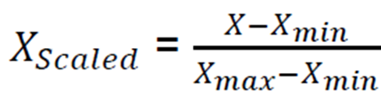
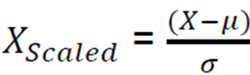

# W4 探索性資料分析與資料前處理

---

## 機器（深度）學習工作流程

1. 定義問題
2. 收集數據
3. 數據前處理
4. 選擇與訓練模型
5. 模型預測與評估

## 數據準備階段(Data Preparation)

- 探索性資料分析(EDA, EXploratory Data Analysis)
    - 統計摘要
    - 數據可視化 (針對數值型欄位)
    - 類別分布分析 (針對類別型欄位)
    - 觀察相關矩陣
- 資料前處理（Data Preprocessing）
    - 處理缺失值
    - 特徵縮放 (針對數值型欄位)
    - 特徵編碼 (針對類別型欄位)
- 特徵工程（Feature Engineering）
    - 特徵生成（Feature Generation）
    - 特徵交互（Feature Interaction）
    - 頻率編碼（Frequency Encoding）
    - 特徵轉換（Feature Transformation）

### 探索性資料分析(EDA)

機器學習中對數據初步分析過程，理解數據結構、分布、異常值並識別潛在的數據問題

- 統計摘要
    - df.describe() 查看數值型特徵的統計數據
    - df.info() 確認數據類型及缺失值
- 數據可視化(針對數值欄位)
    - 直方圖 px.histogram() 顯示數值型特徵的分布
    - 箱型圖 px.box() 檢查數據的異常值與分布
    - 散點圖 px.scatter() 觀察兩個變數之間的關係
- 類別分布分析(針對類別型欄位)
    - 計算類別頻率 df["column"].value_counts() 了解不同類別出現的頻率
    - 長條圖 px.bar() 視覺化類別數據的分布
    - 分組箱型圖 px.box() 觀察類別變數對數值變數的影響


### 觀察相關矩陣

- 識別高相關性變數：如果兩個變數的相關係數 接近 1 或 -1，表示它們具有很強的線性關係，可能可以合併或刪除其中一個變數
- 發現多重共線性：如果多個變數之間高度相關，可能會導致機器學習模型的係數不穩定（特別是在回歸模型中）
- 特徵選擇：可以幫助我們選擇影響較大的變數，減少冗餘特徵，提高模型效能

---

## 資料前處理(Data Preprocessing)

### 處理缺失值

```python
df['Age'].fillna(df['Age'].mean(), inplace=True) # 用平均數填補缺失值
df['Embarked'].fillna(df['Embarked'].mode()[0], inplace=True) # 用最常出現值填補
```

### 特徵縮放（Feature Scaling）

- 在機器學習中，數值特徵的範圍可能相差甚遠，這可能會影響模型的表現，因此我們通常會對特徵進行縮放
- 示例：年齡（1~100） vs. 收入（$20,000~$100,000）
    - 直接輸入可能會讓模型更關注「收入」而非「年齡
    - 透過特徵縮放，使這兩者在相同範圍內（如 0~1），減少偏差
- 主要縮放方法
    - Min-Max Scaling（最小-最大縮放）
    - Standard Scaling（標準化縮放）


#### 最小-最大縮放（Min-Max Scaling）

- 適合數據:  非常態分佈
- 將數據縮放到 [0, 1] 的範圍內



```python
from sklearn.preprocessing import MinMaxScaler

scaler = MinMaxScaler()
df['Fare_minmax'] = scaler.fit_transform(df[['Fare']])

# 適用場景：數據有固定範圍時，例如像像素值 (0-255)
```


#### 標準化縮放（Standard Scaling ）

- 適合數據:  常態分佈
- 將數據轉換為均值為 0，標準差為 1



```python
from sklearn.preprocessing import StandardScaler

scaler = StandardScaler()
df['Fare_standardized'] = scaler.fit_transform(df[['Fare']])

# 適用場景： 當數據分佈接近常態分佈時，標準化效果更好
```

### 特徵編碼（Feature Encoding）

- 機器學習只能處理數值數據，因此類別數據（Categorical Data） 必須轉換為數字格式
- One-Hot Encoding（獨熱編碼）
- Label Encoding（標籤編碼）

#### One-Hot Encoding

對於每個值轉換成二元向量
是自己就是 1 不是就是 0

```python
df = pd.get_dummies(df, columns=['Sex', 'Embarked'])
```

#### Label Encoding 

將每個類別分配一個唯一值

```python
from sklearn.preprocessing import LabelEncoder
encoder = LabelEncoder()
df['Sex_encoded'] = encoder.fit_transform(df['Sex'])
df['Embarked_encoded'] = encoder.fit_transform(df['Embarked'])
```

## 特徵工程 Feature Engineering

- 特徵工程是指從原始數據提取、轉換、創建和選擇有助於機器學習模型的重要特徵
- 優質的特徵能顯著提高模型的性能，甚至比選擇更複雜的算法更重要

重要性

- 增加數據的表達能力，使模型能夠更好地學習模式
- 減少維度，提高訓練效率並降低過擬合風險
- 增強模型的泛化能力，使其更適用於未見數據

### 特徵生成 Feature Generation

將原始數據從中提具有用的內容

```python
import pandas as pd

# 假設我們有共享單車的數據
data = {    
    'date': ['2023-06-01', '2023-06-02', '2023-06-03', '2023-06-04', '2023-06-05'],    
    'temperature': [22, 18, 30, 25, 20],  # °C    
    'humidity': [75, 85, 60, 90, 80],     # %    
    'wind_speed': [10, 12, 8, 5, 15],     # km/h    
    'rental_count': [120, 150, 90, 200, 180]  # 目標變數
}

# 轉換為 DataFrame
df = pd.DataFrame(data)
# 轉換 'date' 為 datetime 類型
df['date'] = pd.to_datetime(df['date’])

# 生成新特徵
df['Day_of_Week'] = df['date'].dt.dayofweek  # 0 = 週一, 6 = 週日
df['Month'] = df['date'].dt.month
df['Year'] = df['date'].dt.year
df['Is_Weekend'] = df['Day_of_Week'].isin([5, 6]).astype(int)  # 1 = 週六/週日, 0 = 平日
df['Is_Rainy'] = (df['humidity'] >= 80).astype(int)  # 1 = 濕度高於 80%
df['Is_Warm'] = (df['temperature'] >= 20).astype(int)  # 1 = 溫度高於 20°C

```


### 特徵交互(Feature Interaction)

- 將兩個或多個特徵結合，創建新的特徵，使機器學習模型能捕捉變數間的關聯性

```python
import pandas as pd

# 假設我們有信用卡消費數據
data = {
    'customer_id': [101, 102, 103, 104, 105],
    'credit_limit': [5000, 10000, 7000, 15000, 12000],  # 信用額度
    'current_balance': [2000, 5000, 1000, 8000, 4000]  # 當前餘額
}

# 轉換為 DataFrame
df = pd.DataFrame(data)

# 生成新特徵：信用額度使用率 (credit_utilization)
df['credit_utilization'] = df['current_balance'] / df['credit_limit']
```


### 頻率編碼(Frequency Encoding)

- 將類別變數(Categorical variables) 轉換為該類別的出現次數，從而幫助模型學習數據的分布
- 適用於 類別值過多時，避免維度爆炸(Dimension Explosion)

```python
import pandas as pd

# 假設我們有一組城市數據
data = {
    'city': ['Phoenix', 'Tempe', 'Scottsdale', 'Chandler', 'Phoenix', 'Tempe', 'Phoenix', 'Chandler', 'Scottsdale', 'Phoenix'],
    'rentals': [100, 50, 30, 45, 120, 60, 130, 50, 35, 110]  
    # 這裡是某種目標變數，例如租借次數
}

# 轉換為 DataFrame
df = pd.DataFrame(data)

# 計算頻率編碼
frequency_encoding = df['city'].value_counts().to_dict()
df['city_frequency'] = df['city'].map(frequency_encoding)
```


### 特徵變換(Feature Transformation)

- 將原始數據轉換成更適合模型學習的格式

```python
import numpy as np
import pandas as pd

# 建立模擬數據
data = {
    'original': [1, 10, 100, 1000, 10000]  # 假設這是收入或觀看次數
}

df = pd.DataFrame(data)

# 1. 對數變換 (Log)
df['log_transform'] = np.log1p(df['original'])  # 使用 log(1+x) 避免 log(0) 問題

# 2. 平方/立方變換
df['square_transform'] = df['original'] ** 2
df['cube_transform'] = df['original'] ** 3

# 3. 平方根/立方根變換
df['sqrt_transform'] = np.sqrt(df['original'])
df['cbrt_transform'] = np.cbrt(df['original'])

# 4. 倒數變換 (Reciprocal)
df['reciprocal_transform'] = 1 / (df['original'] + 1e-9)  # 避免除以零
```

### 自動化特徵工程(Automated Feature Engineering)

- 利用演算法自動生成新特徵，減少手動特徵工程的時間與專業需求

優勢

- 節省時間，減少手動嘗試錯誤的工作量
- 發現複雜模式，提升機器學習模型的表現

